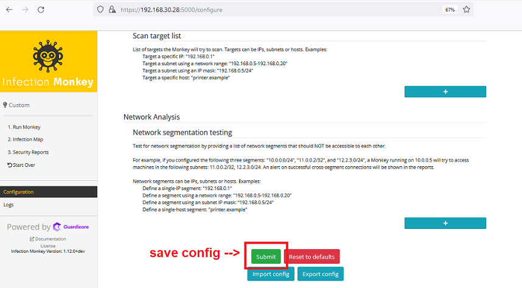
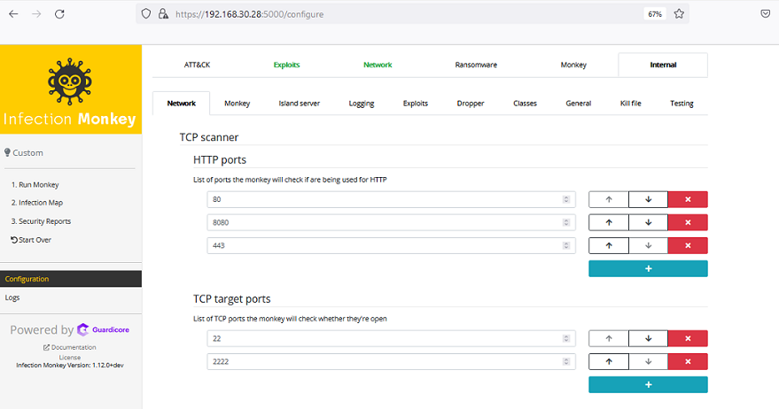
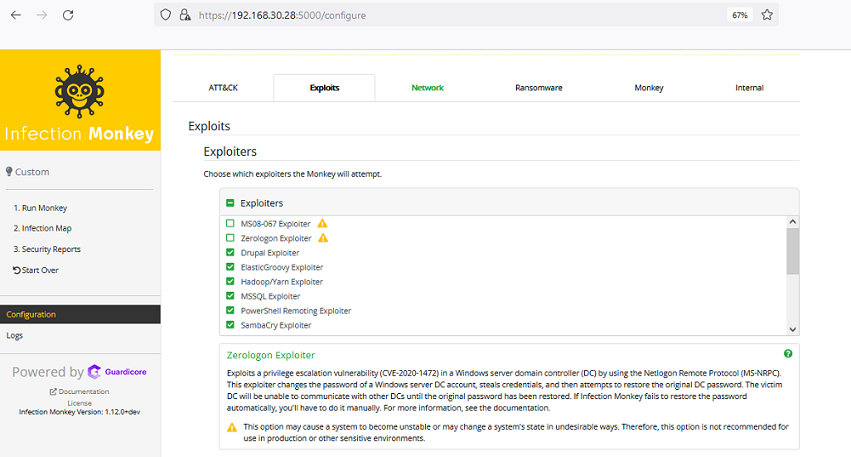

# Emulación de Adversarios
# Infection Monkey   

# ¿Qué es Infection Monkey?  
**Infection Monkey** es una herramienta de pruebas de ciberseguridad, es capaz de adentrarse en el centro de datos en busca de vulnerabilidades y explotarlas. Se instala en una máquina virtual en alguna parte del centro de datos, y desde alli, intentara probar posibles fallos de seguridad. Se comporta más como un hacker que como un escáner de vulnerabilidades. Infection Monkey intentara recorrer el centro de datos aprovechando diferentes tecnicas de movimiento lateral típicos de un atacante real que ya ha comprometido un sistema interno. Cuando logra vulnerar con éxito a una máquina, significará que hay un fallo de seguridad que debe ser solucionado.  

El funcionamiento de Infection Monkey es sencillo. Está diseñado para enumerar la red, comprobar si hay puertos abiertos y tomar las huellas digitales (fingerprint) de las máquinas, utilizando múltiples protocolos de red. Después de detectar las máquinas accesibles, intentara atacar a cada una de ellas utilizando una variedad de métodos que incluyen, entre otros, el bruteforce de contraseñas y la ejecución de exploits conocidos. 

Infection Monkey es un trabajo en curso y aún queda camino por recorrer para aprovechar al máximo sus ventajas.  

# Componentes de Infection Monkey
Infection Monkey posee dos componentes principales:  

- Monkey Island: un servidor web de [C&C](https://www.trendmicro.com/vinfo/us/security/definition/command-and-control-server) que proporciona una interfaz gráfica para los usuarios e interactúa con los Agentes Monkey.  
- Agente Monkey: un programa binario seguro, similar a un gusano, que explora, propaga y simula técnicas de ataque en **la red local**.  

El usuario puede ejecutar el Agente Monkey desde el "Servidor Monkey Island" o distribuir manualmente los binarios del Agente Monkey en la red. Basándose en los parámetros de configuración, los Agentes Monkey escanean, propagan y simulan el comportamiento de un atacante en la red local. Toda la información recopilada sobre la red se agrega en el Servidor Monkey Island y se muestra una vez que todos los Agentes Monkey han terminado.

# Escenario  
El objetivo de este laboratorio es aprender a instalar, configurar y utilizar la herramienta Infection Monkey. Esta herramienta nos permite realizar ataques a gran escala, utilizando ataques muy efectivos, creando nuestro propio sistema de ataque, todo esto con el fin de mejorar nuestra infraestructura, mejorar el equipo de seguridad y sobre todo mejorar las prácticas utilizadas para la defensa de nuestra organización.  

# Objetivos del laboratorio  
El objetivo de este laboratorio es:  

1 - Aprender a realizar un despliegue exitoso de Infection Monkey  
2 - Aprender a configurar y utilizar Infection Monkey  
3 - Enseñar lo que es posible hacer con Infection Monkey  


# Instalación de Infection Monkey
Vamos a la web oficial de Infection Monkey para solicitar la descargar del programa [Download Infection Monkey]( https://www.guardicore.com/infectionmonkey/). En este sitio nos pide llenar un formulario para que envíen por email el link de descarga del programa.  

  

Una vez recibido el correo electrónico, procederemos a la descarga del programa. Esta descarga es un archivo en formato [AppImage](https://appimage.org/). Una AppImage es un paquete independiente de la distribución y autoejecutable, que contiene una aplicación y todo lo que puede necesitar para ejecutarse.

El paquete AppImage de Infection Monkey debería ejecutarse en la mayoría de las distribuciones modernas de Linux que tienen FUSE instalado, pero las que hemos probado son:
- BlackArch 2020.12.01
- Kali 2021.2
- Parrot 4.11
- Rocky 8
- openSUSE Leap 15.3
- Ubuntu Bionic 18.04
- Ubuntu Focal 20.04
- Ubuntu Hirsute 21.04

Mientras de descarga el paquete, procedemos a actualizar nuestro sistema
```
sudo apt update
sudo apt upgrade
```
# Despliegue de Infection Monkey

1 - Hacer ejecutable el paquete AppImage
```
chmod u+x Infection_Monkey_v1.12.0.AppImage
```
2 - Inicie Monkey Island ejecutando el paquete Infection Monkey AppImage
```
./Infection_Monkey_v1.11.0.AppImage  
```
3 - Accede a la interfaz web de Monkey Island. Usando nuestra dirección IP, el protocolo https y el puerto 5000, nos conectaremos a la web de Infection Monkey.  
```
https://<DIRECCION_IP>:5000 
```
1 - Hacemos click en opciones avanzadas.  
2 - Aceptamos el riesgo y continuamos.  

  

# Configuración de Infection Monkey  
## Paso 1 - Login por Primera Vez  
La primera vez que iniciamos **Monkey Island** (el servidor de C&C de Infection Monkey), pedirá que se cree una cuenta (login y password). Tras la creación de la cuenta, el servidor solo será accesible a través de las credenciales que se hayan introducido. 
Para realizar un reset de la cuenta es necesario seguir estos [pasos](https://staging-infectionmonkey.temp312.kinsta.cloud/docs/faq/#resetenable-the-monkey-island-password) 

  

## Paso 2 - Comienzo de Configuración
Una vez iniciada la sesión en Monkey Island procederemos a configurarlo con los parametros del ataque.  

  

## Paso 3 - Configuration Panel (Panel de Configuración)    
En el panel de configuración veremos diferentes pestañas de configuración, pero una de las más importantes es la de los ataques que se van a ejecutar. Pulsando sobre ellas podemos activarlas o desactivarlas.  

  

## Paso 4 - Network Panel (Panel de Red)  
En esta sección se pueden controlar múltiples ajustes importantes, tales como:

- Profundidad de propagación de la red - ¿Cuántos saltos desde la máquina base se propagará Infection Monkey?
- Escaneo de la red local - ¿Debe Infection Monkey intentar atacar cualquier máquina en su subred?
- Lista de IP/subredes del escáner - ¿Qué rangos de IP específicos debe intentar atacar Infection Monkey?

  

## Paso 5 - Guardar siempre los cambios  
Al final de cada sección habrá el siguiente menú en el que está la opción de guardar. Es **MUY** importante siempre guardar los cambios que se realizen en cada pagina.

  

## Paso 6 - Internal Panel (Panel Interno)  
El Internal Panel posee las pestañas para configuraciones mas granulares tanto del servidor Monkey Island, como del Agente Monkey.  
A continuación explicaremos las mas importantes:  

>### Internal Panel/Network  
>Aquí podemos controlar diferentes parametros de la enumeración, como TCP scan interval, TCP scan timeout, Ping scan timeout, ademas de añadir los puertos TCP que queremos >escanear en las máquinas víctimas. Tambien es posible indicar los difererentes numeros de puertos HTTP para realizar enumeración web. 
>
>  
>
>### Internal Panel/Monkey  
>Configuramos el número máximo de máquinas que el Agente Monkey puede escanear y tratar de infectar.
>
>### Internal Panel/Island Server
>Lista de C&C/interfaces de red con los que se intentara comunicar el agente Monkey.
>
>### Internal Panel/Exploit
>Configuración de los exploits precargados de Infection Monkey.

## Paso 7 - Exploit Panel (Panel de Explotación)  
En esta sección podemos configurar los diccionarios con usuarios y contraseñas para intentar acceder al sistema que estamos atacando o analizando.

  

Tambien es esta misma sección se encuentran los "Exploiter", ques son un conjunto de exploits comunes que se pueden utilizar para atacar o analizar los sistemas. Estos exploits son configurables a traves de la pestaña ubicada en "Internal Panel --> Exploits"

  

# Inicializar Infection Monkey  

Vamos al panel de la izquierda y hacemos click en "Run Mokey" y luego en el panel principal seleccionamos la opción 1 de la isla, "From Island", esperamos unos minutos y el programa comenzará a ejecutarse.  

[run](img/run.png)  

# Resultados

>
> MONTANDO LAB
> 


